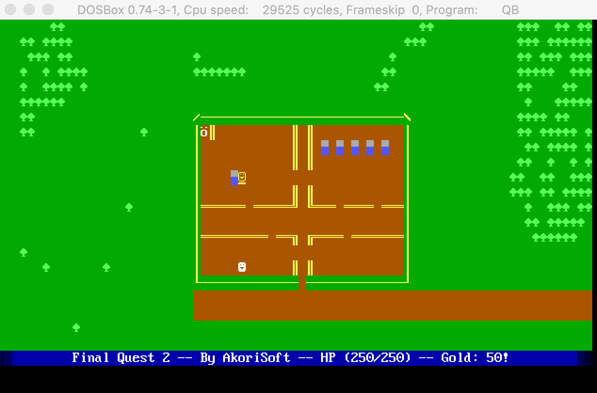
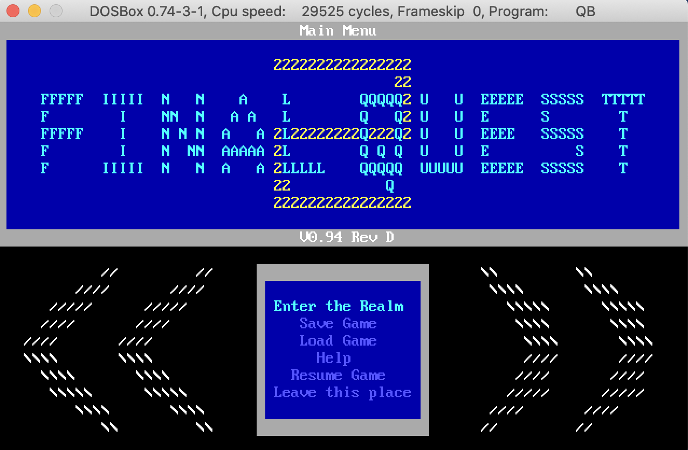
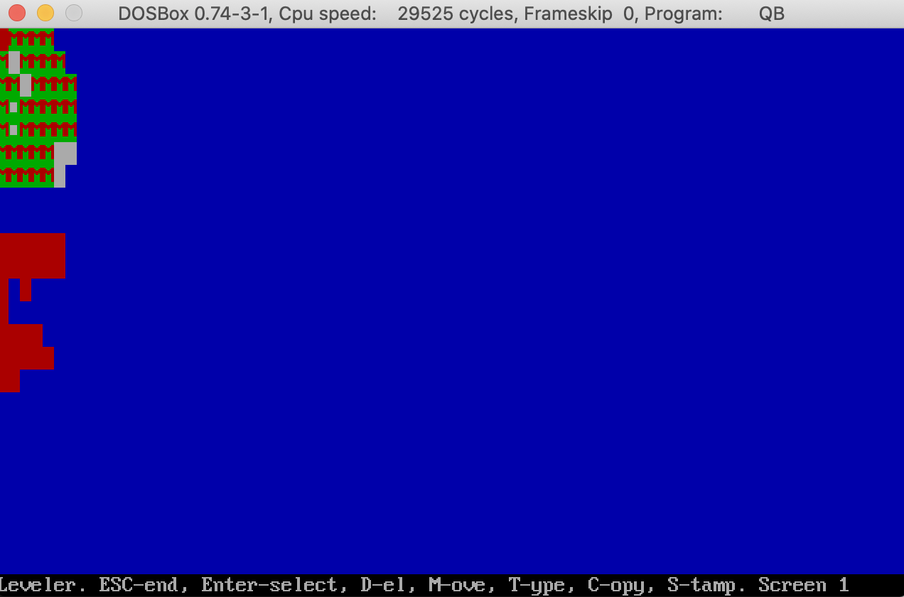
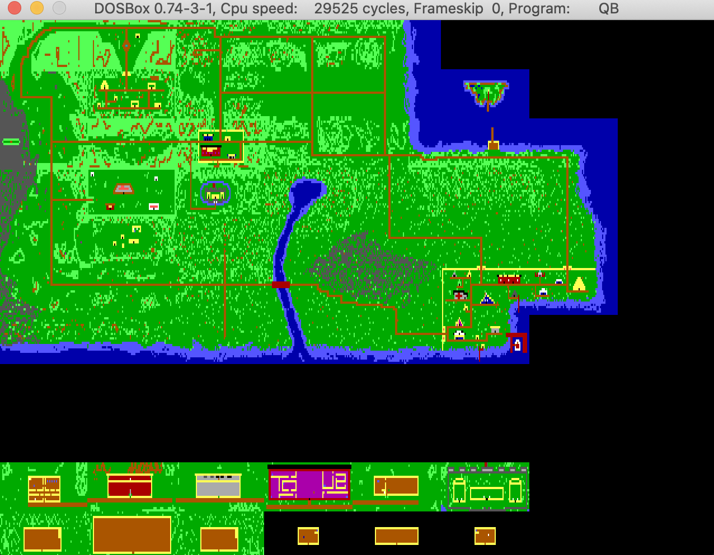

# Final Quest 2

What is this? It's a QBASIC game I worked on in high school (late 90s, early 00s). I was inspired by Legend of the Red Dragon (both 1 and 2) by Seth Robinson, which itself was written in Pascal. At some point, I started keeping versions, which enabled me to add a fake git history.

## Running

The best way to run Final Quest 2 is to use [DOSBox](https://www.dosbox.com/download.php?main=1) with Microsoft QBasic 4.5 (or 7.1). I have not tried to run it using [QB64](https://www.qb64.org/portal/), but it might work.

You must run FQ2 from the directory where it's DAT files are (so it can find them!). To run (in QB45), load FQ2.BAS into QB45, then use the "Load module" option in the File menu to load FQ2MOD2.BAS. I had to split up the BAS file due to the file size limit for BAS files. You should see this when it starts up:

## Level Editor

There is a level editor (LEVEL.BAS) which lets you edit levels (MAPS.DAT):

Game scripting is done via a custom scripting language called REF. The included [documentation](REFFILE.TXT) and [command index](COMMANDS.TXT) is fairly extensive.

## Map Renderer

You can also get a 10000 foot view of your levels by using the map renderer (SHOWALL.BAS):

## Map Generator

Finally, I created a procedural map generator (the previous screenshot shows some of the generated content around the shoreline). Unfortunately, I couldn't get this to work as of today, so it may need some tweaks.
